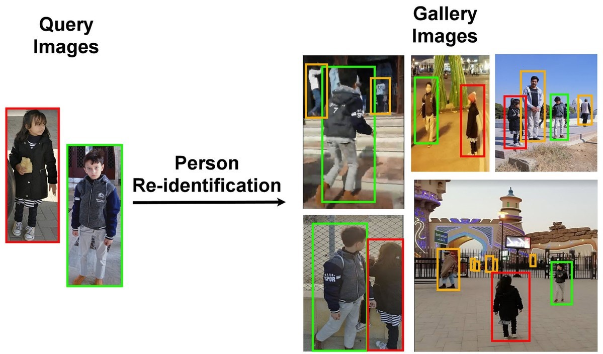
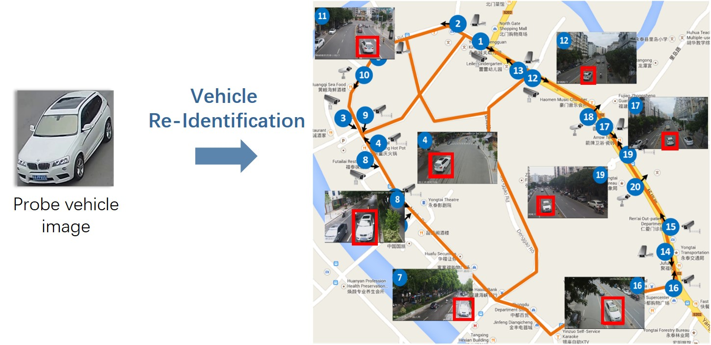
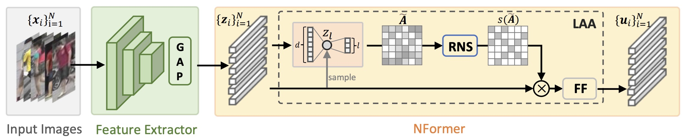

# Person-ReIdentification-Project

<!-- TABLE OF CONTENTS -->
<details open>
  <summary>Table of Contents</summary>
  <ol>
    <li><a href="#about-the-project-open_book">About the project</a></li>
    <li><a href="nformer">Nformer</a></li>
    <li>
      <a href="#getting-started-man_technologist">Getting Started</a>
      <ul>
        <li><a href="#training-rocket">Training</a></li>
        <li><a href="#evaluation-crystal_ball">Evaluation</a></li>
      </ul>
    </li>
    <li><a href="#dataset">Dataset</a></li>
    <li><a href="#contacts">Contacts</a></li>
    <li><a href="#acknowledgments">Acknowledgments</a></li>
  </ol>
</details>


## About the project :open_book:

**This is the repository for the Person Re-Identification project made for the Trends &amp; Applications of Computer Vision UniTN course.**

**The project aims to adapt a system of Person Re-Identification to Vehicle Re-Identification.**

Person Re-Identification (Re-ID) is the task of identifying a specific person across different camera views and locations. It is a critical problem in the field of computer vision and has numerous applications, such as in surveillance systems, smart cities, and retail analytics.
The goal of Person Re-ID is to accurately match a person's appearance in one camera view with their appearance in another camera view, even if the person is wearing different clothes or their appearance has changed due to factors such as lighting or pose.



Vehicle Re-Identification (Re-ID) is the task of identifying a specific vehicle across different camera views and locations. It is a problem that is similar to Person Re-ID, but applied to vehicles instead of people.



## Nformer
For this project, we decided to use the repository of the paper [NFormer: Robust Person Re-identification with Neighbor Transformer](https://arxiv.org/abs/2204.09331) which is available at [Nformer](https://github.com/haochenheheda/NFormer).

In the figure below is reported the structure of the Nformer:




## Getting Started :man_technologist:

### Training :rocket:
Regarding Person Re-ID task:
You can run ```Experiment-all_tricks-tri_center-market.sh``` to train the Nformer on the Market1501 dataset.

If you want to run the training for the task vehicle Re-ID you have to change the dataset in the file ```Experiment-all_tricks-tri_center-market.sh``` from Market1501 to Veri. Then you can run it.

To run the training: 
```cs
sh Experiment-all_tricks-tri_center-market.sh
```


### Evaluation :crystal_ball:

For the evaluation on the Market1501 dataset you can run ```Test-all_tricks-tri_center-feat_after_bn-cos-market.sh```.

If you want to run the evaluation on the Veri dataset you have to change the dataset name in the file ```Test-all_tricks-tri_center-feat_after_bn-cos-market.sh```, moreover you have to change the path of the weights in the folder ```configs```.


To run the evaluation:
```cs
sh Test-all_tricks-tri_center-feat_after_bn-cos-market.sh
```

## Dataset

The dataset used for Person Re-Identification is the Market1501 available at [this](https://zheng-lab.cecs.anu.edu.au/Project/project_reid.html) link.

Regarding the Vehicle Re-Identification task, you have to ask for the permission to use the dataset at [Veri-776 dataset](https://www.v7labs.com/open-datasets/veri-dataset).

## Contacts

Andrea Bonomi - [Github](https://github.com/bonom/) - [LinkedIn](https://www.linkedin.com/in/andreabonomi984/) - [UniTN Email](mailto:andrea.bonomi-2@studenti.unitn.it)
<br>
Khouloud Ismail - [Github](https://github.com/) - [LinkedIn](https://www.linkedin.com/in/khouloudismail/) - [UniTN Email](mailto:khouloud.ismail@studenti.unitn.it)
<br>
Francesco Laiti - [Github](https://github.com/laitifranz/) - [LinkedIn](https://www.linkedin.com/in/francesco-laiti/) - [UniTN Email](mailto:francesco.laiti@studenti.unitn.it)
<br>
Davide Lobba - [Github](https://github.com/davidelobba/) - [LinkedIn](https://www.linkedin.com/in/davide-lobba-659739185) - [UniTN Email](mailto:davide.lobba@studenti.unitn.it)
<br>
Evelyn Turri - [Github](https://github.com/EvelynTurri/) - [LinkedIn](https://www.linkedin.com/in/evelynturri/) - [UniTN Email](mailto:evelyn.turri@studenti.unitn.it)

## Acknowledgments
We thank professor Zhun Zhong for providing us the dataset Veri-776.

Furthermore, we thank professor Cecilia Pasquini for providing us a machine for the training of the Nformer model.


